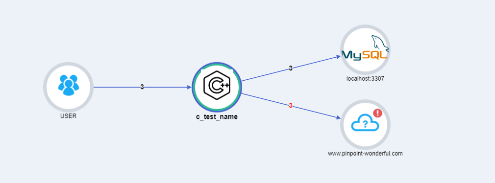
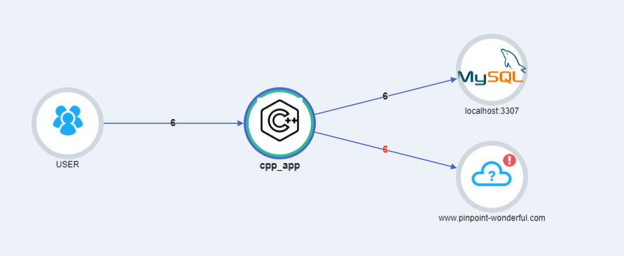
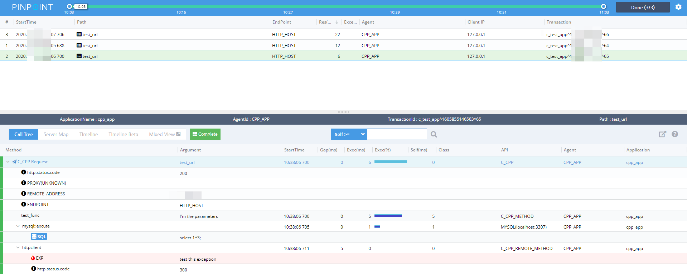

## Getting Started

>At present, we don't not find an easy and stable way to hack the code. You should link the common library and write your plugins on `remote call`, `database`,  `cache` and so on.

While, check example `src/CPP/test_pinpoint.cpp` and `src/CPP/test_pinpoint.c`.
### Requirement

Dependency|Version
---|----
cmake| 3.2+
GCC| GCC `4.7+`

### Build

Use CMake `add_subdirectory`;
[CMakeLists.txt example](../../CMakeLists.txt)

```
$ mkdir build
$ cd build
$ cmake .. && make 
```
### Run

```
$ ./test_pinpoint.c
$ ./test_pinpoint.cpp
```

### Result

C application | Cpp application | callstack
-----|-----|----
||


