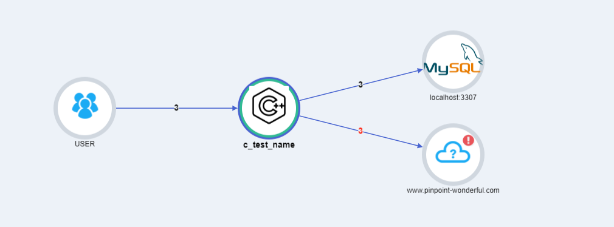
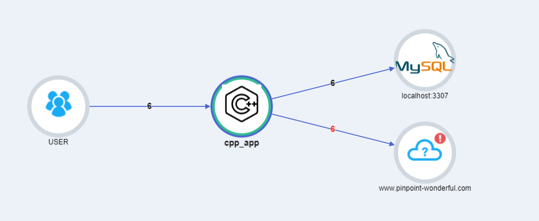
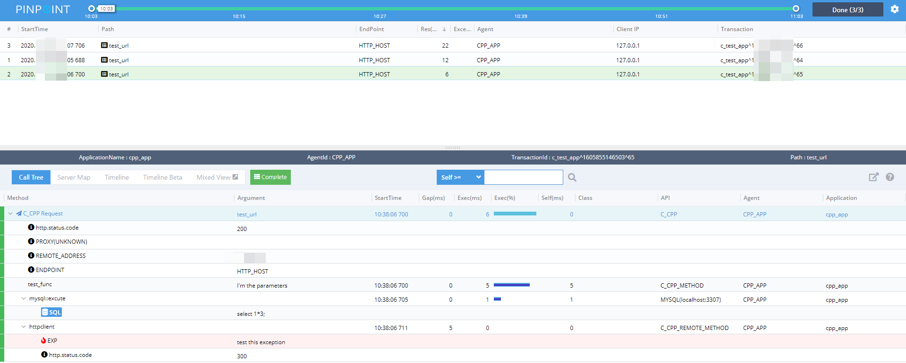

## Getting Started

>At present, we don't find an easy and stable way to hack the code. You should link the common library and write your plugins on `remote call`, `database`,  `cache` and so on.

While, check examples `src/CPP/test_pinpoint.cpp` and `src/CPP/test_pinpoint.c`.
### Requirement

| Dependency | Version    |
| ---------- | ---------- |
| cmake      | 3.15+      |
| CPP | with `std=c++11` |


#### Integrate in your own project 

> Use cmake FetchContent

[CMakeLists.txt example](../../src/CPP/CMakeLists.txt)

```shell
include(FetchContent)

FetchContent_Declare(
  pinpoint 
  URL https://github.com/pinpoint-apm/pinpoint-c-agent/releases/download/v0.7.1/pinpoint-common.tar.gz
)
FetchContent_MakeAvailable(pinpoint)

add_executable(app test_pinpoint.cpp)
target_link_libraries(app PRIVATE  pinpoint_common_static rt)
```


### Run

```
$ ./test_pinpoint.c
$ ./test_pinpoint.cpp
```

### Result

| C application                   | Cpp application                     | callstack                                   |
| ------------------------------- | ----------------------------------- | ------------------------------------------- |
|  |  |  |


### Test apps example 

- [yhirose/cpp-httplib example](../../testapps/cpp-httplib/readme.md)
- [libevent/libevent example](../../testapps/libevent_http_server/readme.md)