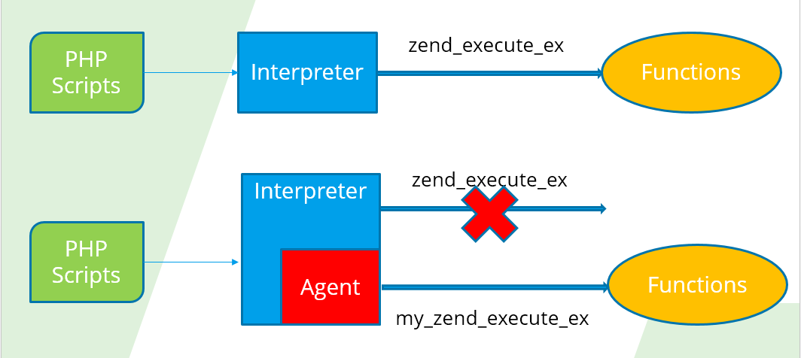
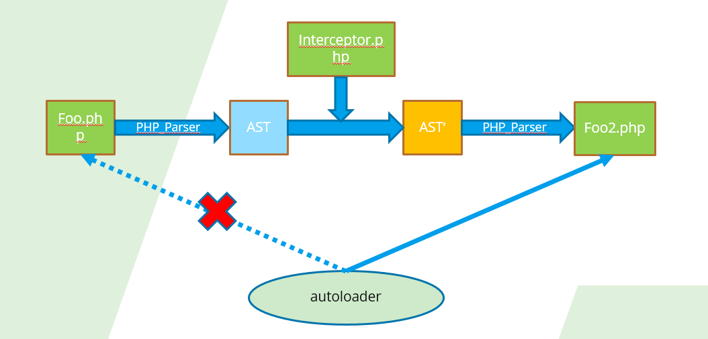

## Support Plan
What we have supported and what we are going to support: [support plan](SupportPlan.md)

## Getting Started

### Requirement

Dependency|Version
---|----
PHP| php `7+` ,`5+`
GCC| GCC `4.7+`
*inux|
Python | `Python 3`
pinpoint| `1.8.0+`, `2.0+`
**Composer**| 

### Installation

#### Steps
1. git clone https://github.com/naver/pinpoint-c-agent.git
   
    > Build pinpoint-php-module

2. Goto your root directory of pinpoint-c-agent installation package 
   1. phpize        
   2. ./configure
   3. make 
   4. make test TESTS=src/PHP/tests/ # We recommend you test whether the module is RIGHT.
   5. make install 
   6. Activation pinpoint module # Add the following to the configuration file in php/lib/php.ini 
   
       >  php.ini 
        ```ini
        extension=pinpoint_php.so
        # unix:(unix sock address)
        pinpoint_php.CollectorHost=unix:/tmp/collector-agent.sock
        # or TCP address
        #pinpoint_php.CollectorHost=Tcp:ip:port
        pinpoint_php.SendSpanTimeOutMs=0 # 0 is recommanded
        # request should be captured duing 1 second. < 0 means no limited
        pinpoint_php.TraceLimit=-1 
        ```
     > Build Collector Agent
3. [Collector Agent Installation ☚](../CollectorAgent/Readme.md)
   
     > Try the aop example
4. Goto Example/PHP (If you use PHP5, goto Example/PHP5)
   1. Download composer.phar. [How to Use Composer?](https://getcomposer.org/doc/00-intro.md)
   2. php composer.phar install
   3. Set $PWD/app/ as your web site root path 


## Changes 

- Fully support ZTS
- More stability 
- Higher performance 
- Easily use and maintain
- Support GRPC

## F & Q

### 1. How to regenerate all AOP files?

 Delete *__class_index_table* in Cache/

### 2. Why not support automatically update AOP files?

We can DO but prefer not DO! Because we have not yet find an efficient way to implement this and monitoring these files status every time is a bad deal.

### 3. How much performance does it lose when using?

After full test, the AOP code could cost at least 1ms in our env(E5-2660 v4 @ 2.00GHz). While, the more function/method you monitoring, the more you taking.

#### Performance Test Result

##### 3.1 [Test Result ☚](./Readme.md#performance-loss-under-stress-test)

##### 3.2 [Flarum Test Result ☚](./User%20Manual.md#1.1-performance-result)

### For the developer

[Plugins Tutorial ☚](../../Example/PHP/Readme.md)

[PHP user manual ☚](./User%20Manual.md)

### Known Issues

#### 1. Exception or error message with a wrong file path.

https://github.com/naver/pinpoint-c-agent/issues/99

#### 2. If I do not use composer/autoloader, can I use this version?

Sorry, `pinpoint-php-aop` does not support wrapping the user class (or internal class) without composer/autoloader. By the way, [Composer](https://getcomposer.org/) is GOOD. O(∩_∩)O

https://github.com/naver/pinpoint-c-agent/issues/103

#### 3. ~Why not support PHP5.x.~ Already done!

https://www.php.net/supported-versions.php

#### 4. ~Generator function is not supported.~ Already done!

https://github.com/naver/pinpoint-c-agent/issues/100

#### 5. Some built-in functions can't AOP
https://github.com/naver/pinpoint-c-agent/issues/102


## The Difference between v0.1.x and v0.2.+

##  v0.1.x VS. v0.2.+

> Why do we refactor the pinpoint_c_agent (v0.1.x)?

1. Hard to support all php versions.
2. Slow, v0.1.x version hooks all functions.
3. Not support ZTS.

### Data route map

#### v0.1.x

> AOP base on zend_excuted_hook


#### v0.2.+

> AOP base on classloader (like java-classloaders)



#### PHP Version Compatibility

Agent version|PHP5.5.x|PHP5.6.x|PHP7.x |php-zts
----|-----|----|-----|---
v0.1.x|✔|✔|✔|✘
v0.2.+|✔|✔|✔|✔

#### PHP Framework

Framework|v0.1.x|v0.2.+
----|-----|----|
Laravel|✔|✔
ThinkPHP|✔|✘
YII|✔|✔
Workerman|✘|✔
EasySwoole|✘|✔


> Note

1. If your php application does not support composer(such as woredpress,phpwind etc), the only choice is v0.1.x.

#### Stability

`v0.2.+ > v0.1.x`


#### Maintainability(Dynamically)

```
✔: Not block user's application.
✘: Block user's application: php-fpm/apache should be restart.
```

Operation|v0.1.x|v0.2.+
----|-----|----
1.Update plugins(CRUD) |✘|✔ [How to ?](https://github.com/naver/php-simple-aop#how-to-reload-all-plugins)
2.Update pinpoint collector|✘|✔
3.Update pinpoint_php.so(pinpoint.so)|✘|✘


#### Performance Loss Under Stress Test

> Test Scene

```
Test Object: PHPMYAdmin
URL: http://dev-mysql-phpmyadmin/db_structure.php?server=1&db=testDB
Plugins Amount: 4
Hooked Times: 30
```

> Test Result

Case|MTT
---|----
phpmyadmin without pinpoint|387.28ms
phpmyadmin with pinpoint-php v0.1|511.46ms
phpmyadmin with pinpoint-php v0.2|398.26ms


```
MTT: Mean RTT Time 
```
> [ pinpoint-php on Flraum test result ](./User%20Manual.md#1.1-performance-result)

> By the way, pinpoint is an APM system but not a performance enhancement system. The loss can't be avoided at present.


### Contributors' words

As composer is widely used, v0.2+ is our long-time support version, and v0.1.x could be obsoleted in the future. But we could fix some fatal error into v0.1.x.