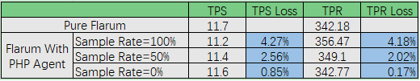
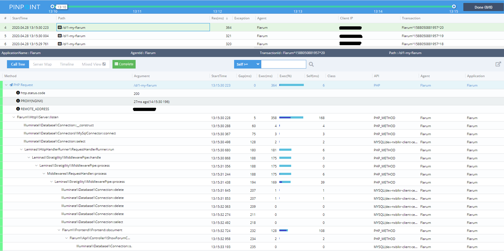

## 1 pinpoint-php agent是如何工作的?

Pinpoint-php agent将[pinpoint-php-aop](https://github.com/pinpoint-apm/pinpoint-php-aop)作为它的方面编程库，它有助于将origin class.php转换为proxied_class.php，其中包括plugins.php和origin.php，而不影响origin class.php的任何函数。

``` php
+--------------+                    +-----------------------+
|  origin.php  |                    | origin.php            |
|              |                    | proxied_origin.php    |
+--------------+                    | require_origin.php    |
                                    | entry for plugins.php |
      ^                             +-----------------------+
      |
      |   Before                                   ^
      |                                            |   After
      |                                            |
      +----+    vender/class_loader        +-------+

```

## 1.1 性能测试结果

> TPS 损耗 和 TPR 损耗



> TPS: time per request（每个请求的响应时间）

>TPR: requests per second（每秒的请求数量）

[如何在Flarum中使用pinpoint-php agent ?](https://github.com/eeliu/pinpoint-in-laravel)

>  调用栈



> 总结
* 当Flarum添加PHP Agent时，损失小于5%。

如果您特别在意性能损耗问题，可以直接调用由C&C++编写的pinpoint-php agent模块API。 [(pinpoint-php api)](../../src/PHP/pinpoint_php_api.php)

## 2 如何hook a object?

```
use A\a as a;
class Foo{
      public function foo(): a
      {
            return new a::factory_create_new();
      }
}

```

> 当foo返回一个新对象时，pinpoint-php-aop很难检测到这个场景。

### 2.1 使用一个装饰器

用onEnd()中的修饰对象替换返回对象。这里有一些[魔术方法](https://www.php.net/manual/en/language.oop5.magic.php)可以帮助“破解”对象。 

[ [如何运作 ☚]](../../plugins/PHP/Plugins/Common/InstancePlugins.php)


### 2.2 示例

#### 2.2.1 Hook a generator

> https://github.com/pinpoint-apm/pinpoint-c-agent/issues/100

``` php
    ...
    function generator($start, $limit, $step=1){
        if($start > $limit){
            throw new LogicException("start cannot bigger that limit.");
        }
        usleep(120000);
        for($i = $start; $i<=$limit; $i += $step){
            try{
                yield $i;
            }catch (Exception $exception){
                echo $exception->getMessage();
            }
        }
    }
    ...
```
[ [跳转到 GeneratorPlugin ☚] ](../../plugins/PHP/Plugins/AutoGen/app/GeneratorPlugin.php)

#### 2.2.2 PDO::prepare方法返回了一个PDOStatement类

``` php
Reference： https://www.php.net/manual/zh/pdo.prepare.php
<?php

$sth = $dbh->prepare('SELECT name, colour, calories
    FROM fruit
    WHERE calories < ? AND colour = ?');
$sth->execute(array(150, 'red'));
$red = $sth->fetchAll();
$sth->execute(array(175, 'yellow'));
$yellow = $sth->fetchAll();
?>

```

用[Plugins\PDOStatement](../../plugins/PHP/Plugins/Sys/PDO/ProfilerPDOStatement.php)替换$dbh->prepare方法的返回值
