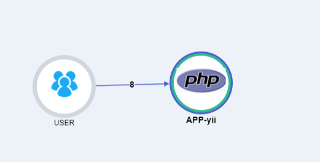

# Php agent 已经支持Yii !

> 备注: php-agent 重写 Yii 框架的类加载器。因此，您应该遵循以下步骤。


## 步骤

1. 请将 Yii 的 'web/index.php'替换掉，使用我们的 'web/index.php'
2. 将插件复制到您的根目录并启用自动加载

 > composer.json

``` 
  "autoload": {
        "psr-4": {
            "Plugins\\": "Plugins/"
        }
    },
```

3. 添加需求

 > composer.json

```
 "require": {
     ...
     "naver/pinpoint-php-aop": "v1.0.1"
     ...
 }


```

4. 让它运转
   
``` shell
    $ composer install (or composer update )
```


## Demo 


> server map 

 

> call stack


## 参考资料
1. 如何安装 yii? [ 请点击 ☚ ](https://www.yiiframework.com/doc/guide/2.0/en/start-installation)
2. pinpoint-php-aop是什么? [ 请点击☚ ](https://github.com/naver/pinpoint-php-aop)