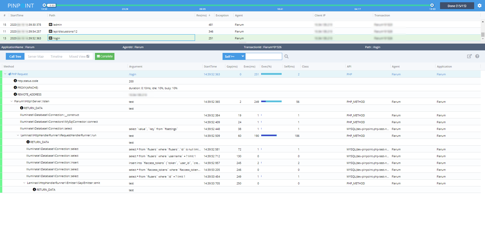

## 如何使用 ?

### 步骤

1. 在composer.json中包含php_simple_aop
 
```
   "require": {
        "eeliu/php_simple_aop": "v0.2.4"
    }
```

2. 将插件复制到web根路径并启用自动加载

```
    "autoload": {
        "psr-4": {
            
             "Plugins\\": "Plugins/"
        }
    }
```

3. 在site.php中插入pinpoint header

``` php
#####################################################################################
define('AOP_CACHE_DIR',__DIR__.'/Cache/');
define('PLUGINS_DIR',__DIR__.'/Plugins/');
define('APPLICATION_NAME','Flarum');
define('APPLICATION_ID','Flarum');
// Support partly loader
// define('USER_DEFINED_CLASS_MAP_IMPLEMENT','\Plugins\ClassMapInFile.php');
require_once __DIR__. '/vendor/eeliu/php_simple_aop/auto_pinpointed.php';

#####################################################################################
```

## 输出

### 调用栈


### ServerMap
