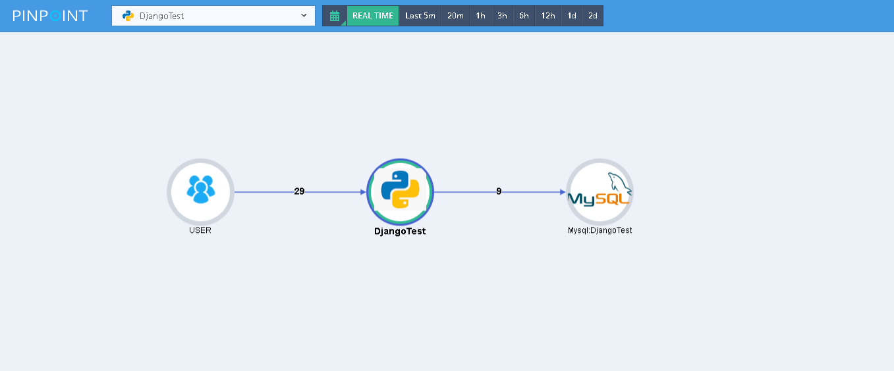
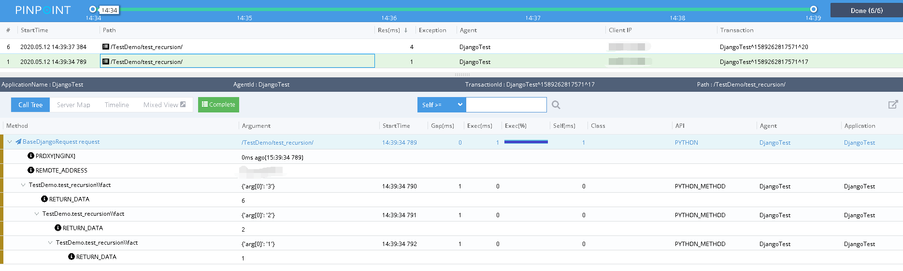

# 将pinpoint集成到Django中


## 集成Pinpoint

> 确保安装了pinpointPy模块。([如何安装pinpointPy模块](../../../DOC/PY/Readme.md))
1. 将```pinpoint``` 目录复制到您项目的根目录， 在Django的设置文件中，将 ```PinPointMiddleWare``` 添加到 ```MIDDLEWARE``` 

    ```
    .....
    MIDDLEWARE = [
        'pinpoint.PinPointMiddleWare.PinPointMiddleWare',
        ......
    ]
    ```
2. 将[插件](../plugins)复制到```pinpoint``` 目录。 ```plugin``` 里的插件是一些示例，您也可以根据这些例子编写您自己的插件。

3. Hook 您所关心的函数。
     > 示例: django/test_recursion.py
     Hook the function ```fact``` by add ```@PinpointCommonPlugin('', __name__)``` just before it.
    
    
    ```
    from pinpoint.plugins.PinpointCommonPlugin import PinpointCommonPlugin
    
    
    @PinpointCommonPlugin('', __name__)
    def fact(n):
        ......
    ```

## Demo 


> server map 

 

> 调用栈



