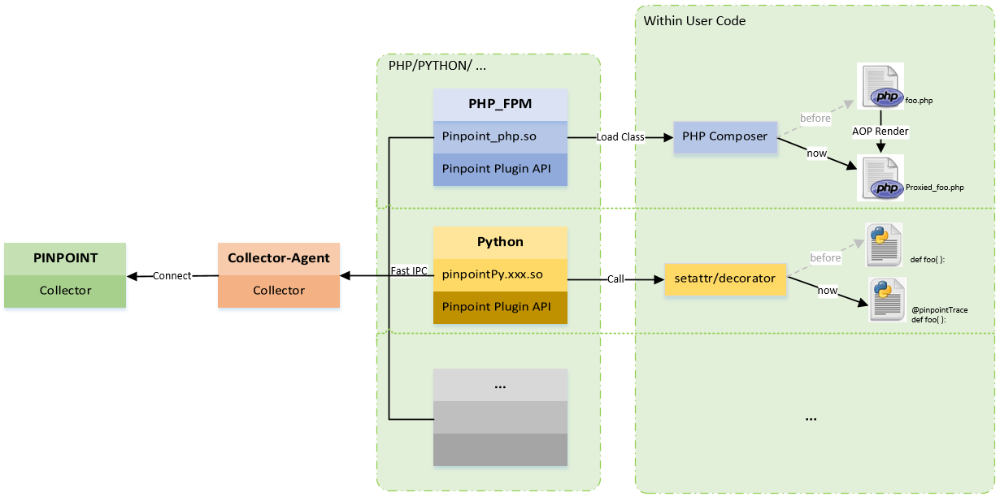
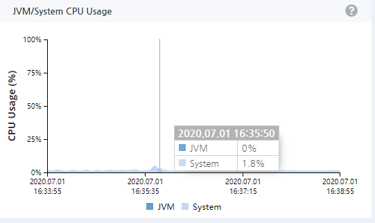
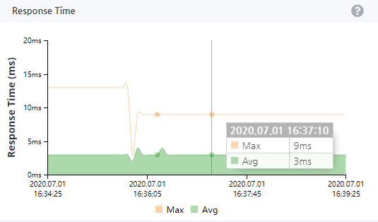

[](https://travis-ci.com/naver/pinpoint-c-agent) [](https://gitter.im/naver/pinpoint-c-agent?utm_source=badge&utm_medium=badge&utm_campaign=pr-badge)

*请访问我们的[官方网站](http://naver.github.io/pinpoint/)，了解更多关于 Pinpoint 的信息和[最新版本](https://naver.github.io/pinpoint/news.html)*。

目前稳定的版本是[最新版](https://github.com/naver/pinpoint-c-agent/releases)。

# Pinpoint Common Agent

Agent由c++、PHP、python语言编写，我们希望后续能支持其他语言。目前为止，它支持 **_PHP_** 和 **_PYTHON_**。

## 如何在PHP中使用？

 [请点击 ☚](DOC/PHP/Readme-CN.md)

## 如何在PYTHON3中使用？

[请点击 ☚](DOC/PY/Readme-CN.md)

## Pinpoint Common Agent 概况

### Pinpoint-c-agent 


### 分布式跟踪系统


### 调用栈

 | 
--- | ---
 | 

### 实时跟踪图表

 CPU | Response Time
 --- | ---
  | 


## 联系我们
* 提交[问题](https://github.com/naver/pinpoint-c-agent/issues)
* 中国社区：

QQ Group1: 897594820 | QQ Group2: 812507584 | DING Group
:---:| :---: | :---:
 |  | 


## 许可证
此项目是在Apache许可证2.0版本下授权的。
请点击[许可证](LICENSE)获取完整的许可证文本。

```
Copyright 2020 NAVER Corp.

Licensed under the Apache License, Version 2.0 (the "License");
you may not use this file except in compliance with the License.
You may obtain a copy of the License at

    http://www.apache.org/licenses/LICENSE-2.0

Unless required by applicable law or agreed to in writing, software
distributed under the License is distributed on an "AS IS" BASIS,
WITHOUT WARRANTIES OR CONDITIONS OF ANY KIND, either express or implied.
See the License for the specific language governing permissions and
limitations under the License.
```
