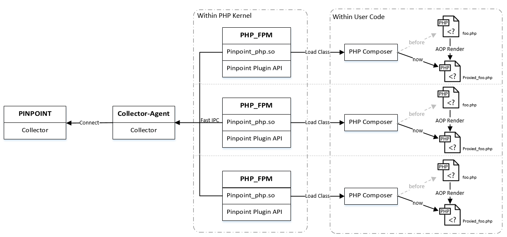
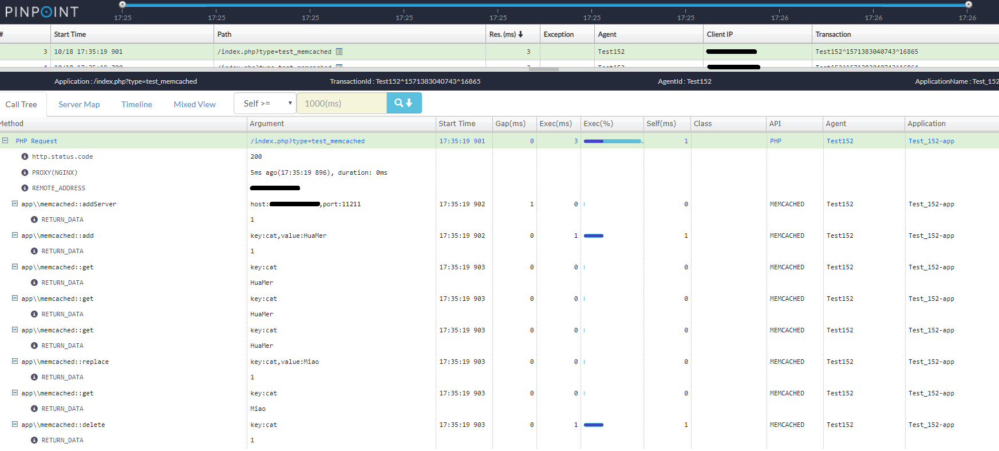
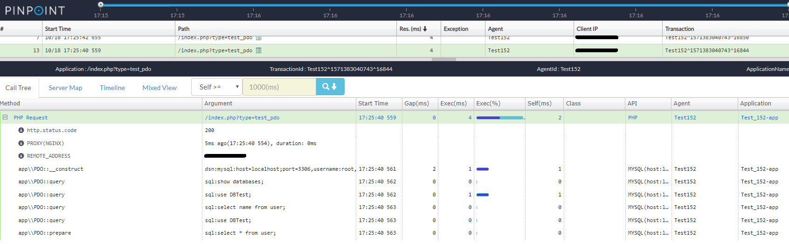
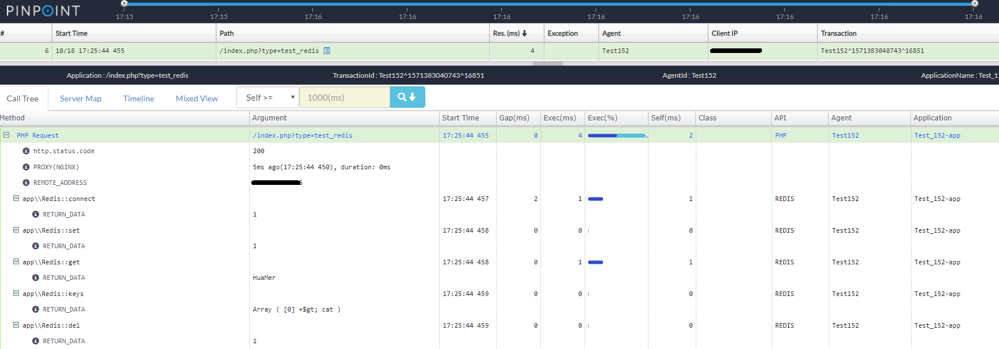

[](https://travis-ci.com/naver/pinpoint-c-agent) [](https://gitter.im/naver/pinpoint-c-agent?utm_source=badge&utm_medium=badge&utm_campaign=pr-badge)

**Visit [our official web site](http://naver.github.io/pinpoint/) for more information and [Latest updates on Pinpoint](https://naver.github.io/pinpoint/news.html)**  


The current stable version is [the latest](https://github.com/naver/pinpoint-c-agent/releases).

# Pinpoint PHP Agent

It is an agent written by C++, PHP, python language. And we hope to support other languages by this agent. Until now, it supports PHP language.

## 1 The Difference Between v0.1.x And v0.2.x

[Click me ☚](PHP/Readme.md)

## 2 Getting Started
 
### 2.1 Requirement

Dependency|Version
---|----
PHP| php 7+
GCC| GCC 5+
*nux|
Python | Python3
pinpoint| 1.8.0-RC1+
**Composer**| 

### 2.2 Installation

#### 2.2.1 Steps
1. git clone https://github.com/naver/pinpoint-c-agent.git
   
> Build pinpoint-php-module

2. Goto PHP/pinpoint_php_ext
   1. phpize        
   2. ./configure
   3. make 
   4. make test # We recommend you test whether the module is RIGHT.
   5. make install 
   6. Activation pinpoint module # Add the following to the configuration file in php/lib/php.ini 
   
       >  php.ini 
        ```ini
        extension=pinpoint_php.so
        # must be unix:(unix sock address)
        pinpoint_php.CollectorHost=unix:/tmp/collector-agent.sock
        pinpoint_php.SendSpanTimeOutMs=0 # 0 is recommanded
        # request should be captured duing 1 second. < 0 means no limited
        pinpoint_php.TraceLimit=-1 
        ```
> Build Collect-agent
3. Goto collector-agent
   1. python3 -m venv env
   2. source env/bin/activate
   3. pip3 install -r requirements.txt
   4. Change configuration file in conf/collector.conf

        ```ini
        [Collector]
        # collectorhost and specific port
        ### For thrift  pinpoint 1.8.0-RC1+
        #CollectorSpanIp=collectorHost
        #CollectorSpanPort=9905
        #CollectorStatIp=collectorHost
        #CollectorStatPort=9906
        #CollectorTcpIp=collectorHost
        #CollectorTcpPort=9907
        ### For GRPC  pinpoint 2.0+
        AgentID=your_id
        ApplicationName=your_name
        collector.grpc.agent.ip=collectorHost
        collector.grpc.agent.port=9991
        collector.grpc.stat.ip=collectorHost
        collector.grpc.stat.port=9992
        collector.grpc.span.ip=collectorHost
        collector.grpc.span.port=9993
        [Common]
        # your web server (nginx&apache) port
        Web_Port=8001   
        # debug in dev
        Log_Level=ERROR 
        # make sure LOG_DIR is exist
        # The real-time log of collector-agent can be checked under this path with the command " tail -f ".
        LOG_DIR=/your log dir/ 
        [Agent]
        # the same as below "pinpoint_php.CollectorHost"
        Address=/tmp/collector-agent.sock
        ```
    5. export COLLECTOR_CONFIG=/full path of collector.conf/
    6. run  collector-agent
        ```
        $ ./init_python_env.sh
        $ python run.py 
        ```
   
> Try the aop example
4. Goto PHP/pinpoint_php_example
   1. Download composer.phar. [How to Use Composer?](https://getcomposer.org/doc/00-intro.md)
   2. php composer.phar install
   3. Set $PWD/app/ as your web site root path # namely, set the path of nginx to the collector-agent path in configuration file conf/nginx.conf.

## 2 Overview

### 2.1 Pinpoint-c-agent 


### 2.2 Distributed Tracking system

### 2.3 Call Stack

 | 
--- | ---
 | 

## 3 Compatibility

Pinpoint Version | PHP| Python|GCC
---------------- | ----- | -----|---
1.8.0-RC1 | PHP 7+ | Python3|GCC 5+

[ [ Changes ☚] ](./Changes.md)

## 4 Contact Us
* Submit an [issue](https://github.com/naver/pinpoint-c-agent/issues)
* Chinese Community:

QQ Group: 897594820 | DING Group
:---:| :---:
 | 

## 5 F & Q

### 5.1 How to regenerate all AOP files?

Delete *__class_index_table* in Cache/

### 5.2 Why not support automatically update AOP files?

We can DO but prefer not DO! Because we have not yet find an efficient way to implement this and monitoring these files status every time is a bad deal.

### 5.3 How much performance does it lose when using?

After full test, the AOP code could consume at least 1ms in our env(E5-2660 v4 @ 2.00GHz). While, the more function/method you monitoring, the more you taking. 

[Test Result ☚](PHP/Readme.md#performance-loss-under-stress-test)

[FLarum Test Result ☚](DOC/PHP/User%20Manual.md#11-performance-result)

### 6 For the developer

[Plugins Tutorial ☚](PHP/pinpoint_php_example/Readme.md)

[PHP user manual ☚](DOC/PHP/User%20Manual.md)

### 7 Known Issues

#### 7.1 Exception or error message with a wrong file path.

https://github.com/naver/pinpoint-c-agent/issues/99

#### 7.2 If I do not use composer/autoloader, can I use this version?

Sorry, `php-simple-aop` not support wrapping the user class (or internal class) without composer/autoloader. By the way, [Composer](https://getcomposer.org/) is GOOD. O(∩_∩)O

https://github.com/naver/pinpoint-c-agent/issues/103

#### 7.3 Why not support PHP5.x?

https://www.php.net/supported-versions.php

#### ~7.4 Generator function is not supported.~ Already done!
https://github.com/naver/pinpoint-c-agent/issues/100

#### 7.5 Some built-in functions can't AOP
https://github.com/naver/pinpoint-c-agent/issues/102

## License
This project is licensed under the Apache License, Version 2.0.
See [LICENSE](LICENSE) for full license text.

```
Copyright 2020 NAVER Corp.

Licensed under the Apache License, Version 2.0 (the "License");
you may not use this file except in compliance with the License.
You may obtain a copy of the License at

    http://www.apache.org/licenses/LICENSE-2.0

Unless required by applicable law or agreed to in writing, software
distributed under the License is distributed on an "AS IS" BASIS,
WITHOUT WARRANTIES OR CONDITIONS OF ANY KIND, either express or implied.
See the License for the specific language governing permissions and
limitations under the License.
```
