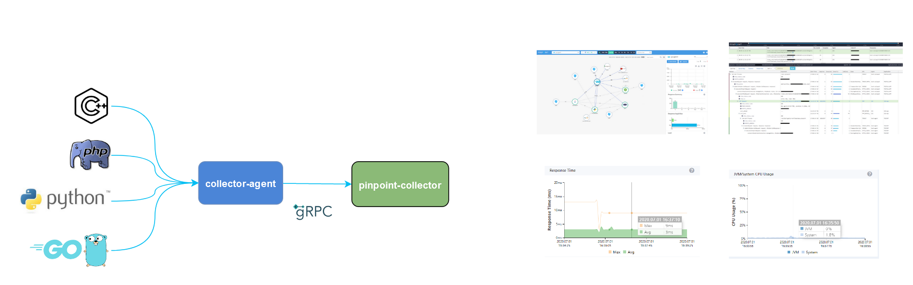

[](https://github.com/pinpoint-apm/pinpoint-c-agent/actions) [](https://gitter.im/naver/pinpoint-c-agent?utm_source=badge&utm_medium=badge&utm_campaign=pr-badge) [](https://codecov.io/gh/pinpoint-apm/pinpoint-c-agent) [](LICENSE)


**Visit [our official website](http://pinpoint-apm.github.io/pinpoint/) for more information and [the Latest updates on Pinpoint](https://pinpoint-apm.github.io/pinpoint/news.html)**  


The current stable version is [the Latest](https://github.com/pinpoint-apm/pinpoint-c-agent/releases).

# Pinpoint Common Agent

It is an agent written by C++, PHP and Python languages. And we hope to support other languages by this agent. Until now, it supports **_PHP_**, **_C/CPP_** and **_PYTHON_**.

## Overview Pinpoint Common Agent

### How does it work



### Distributed Tracking system


### Call Stack

 | 
--- | ---
 | 

### Real-time Tracking Chart

 CPU | Response Time
 --- | ---
  | 


## Installation guide

**Components:**
* Collector-Agent (**Required**)
* PHP-Agent
* Python-Agent
* c/cpp=Agent
* Golang-Agent

### Install Collector-Agent

[How to install Collector-Agent](DOC/collector-agent/readme.md)

### Install PHP / Python / C/CPP / Golang Agent

language| tutorial
---|---
php|[English](DOC/PHP/Readme.md) [中文](DOC/PHP/Readme-CN.md) [한국어](DOC/PHP/Readme-KR.md)
python3|[English](DOC/PY/Readme.md) [中文](DOC/PY/Readme-CN.md) [한국어]((DOC/PY/Readme-KR.md))
c/cpp|[English](DOC/C-CPP/Readme.md)
golang|[go-aop-agent](https://github.com/pinpoint-apm/go-aop-agent) 

## Contact Us

* Submit an [issue](https://github.com/pinpoint-apm/pinpoint-c-agent/issues)
* [Gitter char room](https://gitter.im/naver/pinpoint-c-agent)
* Chinese Community (QQ Group: 882020485)
    <details>
    <summary> show more 
    </summary>

    QQ Group1: 897594820 | QQ Group2: 812507584 | QQ Group3: 882020485| DING Group : 21981598
    :----------------: |:----------------: | :-----------: | :-----------: 
     | | | 

</details>

## Contributing
We are looking forward to your contributions via pull requests.

### Contributors

<table>
<tr>
    <td align="center" style="word-wrap: break-word; width: 75.0; height: 75.0">
        <a href=https://github.com/eeliu>
            
            <br />
            <sub style="font-size:7px"><b>eeliu</b></sub>
        </a>
    </td>
    <td align="center" style="word-wrap: break-word; width: 75.0; height: 75.0">
        <a href=https://github.com/EyelynSu>
            
            <br />
            <sub style="font-size:7px"><b>Evelyn</b></sub>
        </a>
    </td>
    <td align="center" style="word-wrap: break-word; width: 75.0; height: 75.0">
        <a href=https://github.com/Zoey-dot>
            
            <br />
            <sub style="font-size:7px"><b>Zoey</b></sub>
        </a>
    </td>
    <td align="center" style="word-wrap: break-word; width: 75.0; height: 75.0">
        <a href=https://github.com/ChenGXQQ>
            
            <br />
            <sub style="font-size:7px"><b>chenguoxi</b></sub>
        </a>
    </td>
    <td align="center" style="word-wrap: break-word; width: 75.0; height: 75.0">
        <a href=https://github.com/marty-macfly>
            
            <br />
            <sub style="font-size:7px"><b>Macfly</b></sub>
        </a>
    </td>
    <td align="center" style="word-wrap: break-word; width: 75.0; height: 75.0">
        <a href=https://github.com/mayingping-Bella>
            
            <br />
            <sub style="font-size:7px"><b>mayingping-Bella</b></sub>
        </a>
    </td>
</tr>
<tr>
    <td align="center" style="word-wrap: break-word; width: 75.0; height: 75.0">
        <a href=https://github.com/emeroad>
            
            <br />
            <sub style="font-size:7px"><b>Woonduk Kang</b></sub>
        </a>
    </td>
</tr>
</table>


## License
This project is licensed under the Apache License, Version 2.0.
See [LICENSE](LICENSE) for full license text.

```
Copyright 2020 NAVER Corp.

Licensed under the Apache License, Version 2.0 (the "License");
you may not use this file except in compliance with the License.
You may obtain a copy of the License at

    http://www.apache.org/licenses/LICENSE-2.0

Unless required by applicable law or agreed to in writing, software
distributed under the License is distributed on an "AS IS" BASIS,
WITHOUT WARRANTIES OR CONDITIONS OF ANY KIND, either express or implied.
See the License for the specific language governing permissions and
limitations under the License.
```
