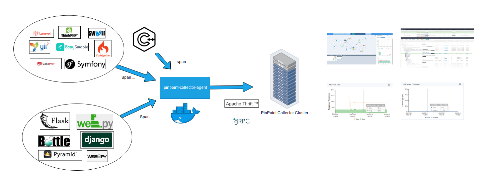

[](https://github.com/pinpoint-apm/pinpoint-c-agent/actions) [](https://gitter.im/pinpoint-apm/pinpoint-c-agent?utm_source=badge&utm_medium=badge&utm_campaign=pr-badge) [](https://codecov.io/gh/pinpoint-apm/pinpoint-c-agent) [](LICENSE)


**Visit [our official website](http://pinpoint-apm.github.io/pinpoint/) for more information and [the Latest updates on Pinpoint](https://pinpoint-apm.github.io/pinpoint/news.html)**  


The current stable version is [the Latest](https://github.com/pinpoint-apm/pinpoint-c-agent/releases).

# Pinpoint Common Agent

It is an agent written by C++, PHP and Python languages. And we hope to support other languages by this agent. Until now, it supports **_PHP_**, **_C/CPP_** and **_PYTHON_**.

## PHP tutorial

[ I use PHP !!! ☚](DOC/PHP/Readme.md)

## PYTHON tutorial

[I use PYTHON ☚](DOC/PY/Readme.md)

## C/CPP tutorial

[Use c/cpp application ☚](DOC/C-CPP/Readme.md)

## Overview Pinpoint Common Agent

### Pinpoint-c-agent 


### Distributed Tracking system


### Call Stack

 | 
--- | ---
 | 

### Real-time Tracking Chart

 CPU | Response Time
 --- | ---
  | 
 
## Contact Us
* Submit an [issue](https://github.com/pinpoint-apm/pinpoint-c-agent/issues)
* Chinese Community:

QQ Group1: 897594820 | QQ Group2: 812507584 | DING Group
:---:| :---: | :---:
 |  | 


## License
This project is licensed under the Apache License, Version 2.0.
See [LICENSE](LICENSE) for full license text.

```
Copyright 2020 NAVER Corp.

Licensed under the Apache License, Version 2.0 (the "License");
you may not use this file except in compliance with the License.
You may obtain a copy of the License at

    http://www.apache.org/licenses/LICENSE-2.0

Unless required by applicable law or agreed to in writing, software
distributed under the License is distributed on an "AS IS" BASIS,
WITHOUT WARRANTIES OR CONDITIONS OF ANY KIND, either express or implied.
See the License for the specific language governing permissions and
limitations under the License.
```
