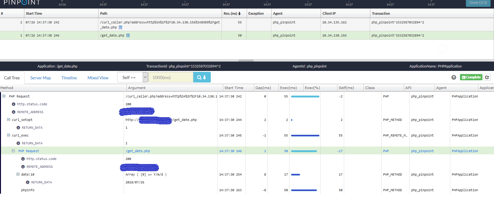

**Visit [our official web site](http://naver.github.io/pinpoint/) for more information and [Latest updates on Pinpoint](https://naver.github.io/pinpoint/news.html)**  


The current stable version is [v0.1.0](https://github.com/naver/pinpoint-c-agent/releases).

# Pinpoint C Agent

It is an agent written by C/C++ language. And we hope to support other languages by this agent. Until now, it supports PHP language.

## Getting Started

### Requirement

Dependency|Version
---|----
APACHE| 2.2.x 2.4.x
PHP| php 5.4.x 5.5.x 5.6.x 7x
OS| 64bit only
Boost | 1.5.8+
Thirft|0.10.0+
gcc| 4.4.7+


### Installation

#### Pre-install
- Download pinpoint-c-agent:  git clone https://github.com/naver/pinpoint-c-agent.git
 
- Install third-library  
 
    Option 1. Install from source code
    - [Install Boost 1.6.3+](https://www.boost.org/doc/libs/1_63_0/doc/html/bbv2.html#bbv2.installation)
        - wget https://jaist.dl.sourceforge.net/project/boost/boost/1.63.0/boost_1_63_0.tar.gz
        - tar -zxvf boost_1_63_0.tar.gz && cd boost_1_63_0
        - ./bootstrap.sh
        - ./b2 install --prefix=PREFIX
    
    - [Install Thrift 0.10.0+](http://thrift.apache.org/docs/install/)
        - wget http://apache.fayea.com/thrift/0.10.0/thrift-0.10.0.tar.gz
        - tar zxvf thrift-0.10.0.tar.gz  
        - cd thrift-0.10.0  
        - ./configure --with-cpp --with-php=no --with-python=no --with-ruby=no --with-nodejs=no --with-qt4=no --with-java=no
        - make 
        - make install 
     
    Option 2. Use deploy_third_party.sh
     
    >    If `WITH_BOOST_PATH` and `WITH_THRIFT_PATH` are not in your system env, `deploy_third_party.sh` will automatic install these into your directory.

    1. The boost will be installed at /usr/local. Please ensure you have the authority. (Use su or sudo)
    2. When it run, agent will use the dynamic libraris. So please add your installed path in LD_LIBRARY_PATH. (export LD_LIBRARY_PATH=/home/test/var/lib:\$LD_LIBRARY_PATH)

        ```
        $ ./deploy_third_party.sh /home/test/var
        ...
        ...
        --------------------------------------------------------------------
        Adding below into your system
        export WITH_BOOST_PATH=/usr/local/
        export WITH_THRIFT_PATH=/home/test/var
        export LD_LIBRARY_PATH=/home/test/var/lib:\$LD_LIBRARY_PATH
        --------------------------------------------------------------------
        NOTE: Keeping /home/test/var/lib in your LD_LIBRARY_PATH when you run pinpoint_php_agent
        --------------------------------------------------------------------

        ```


-  [phpize](http://php.net/manual/en/install.pecl.phpize.php) (In your php installation path)
  
#### Build php-agent

1. Checking phpize is in your PATH.
    If not, install phpize and export in your system PATH.(eg:export PATH=/path to phpize/:$PATH)
2. Specifying BOOST and THRIFT path  
    
    ```
    # eg: header file in /usr/local/include/boost and /usr/local/include/thrift
    export WITH_BOOST_PATH='/usr/local/include'
    export WITH_THRIFT_PATH='/usr/local/include' 
    ```

3. Run cd pinpoint_php && ./Build.sh  && make install
4. If **_3_** running successfully, agent had installed into php module.

#### Startup 
1. Modifying below options in the "pinpoint_agent.conf" (eg:pinpoint_c_agent/quickstart/config/pinpoint_agent.conf.example)
```
      AgentID=uniquely identifies the application instance in which the agent is running on
      ApplicationName= groups a number of identical application instances as a single service
      Collector*= pinpoint collector information  
      LogFileRootPath=/absolute ​path where logging to/
      PluginRootDir​=/absolute path to /web/plugins/​
```
2. Enable pinpoint-agent-php into php.ini, and configuring extension and pinpoint_agent.config_full_name (eg:pinpoint_c_agent/quickstart/config/php.ini.example)
3. Restart php-fpm/Apache
4. After restart php-fpm/Apache, if you meet "xxx pinpoint_api.cpp:158 [INFO] common.AgentID=php_pinpoint ...." in your LogFileRootPath/pinpoint_log.txt, pinpoint-agent-php installed successfully. If not, contract us without hesitation. 

#### Collect result from the Pinpoint 
1. Configure pinpoint_c_agent/quickstart/php/web/ as your web side.
2. Access http://\$serverip:\$port/index.php 
3. Log into pinpoint-web and choose the right ApplicationList 

## Overview

### Distributed Tracking system


### Call Stack



## Compatibility

Pinpoint Version | PHP|GCC|Boost| Thrift|
---------------- | ----- | --------- |----|----|
1.7.3 | 5.3.x <br> 5.4.x <br> 5.5.x <br> 5.6.x <br> 7.x |gcc 4.4.7+|1.5.8+|0.10.0+|

## License
This project is licensed under the Apache License, Version 2.0.
See [LICENSE](LICENSE) for full license text.

```
Copyright 2018 NAVER Corp.

Licensed under the Apache License, Version 2.0 (the "License");
you may not use this file except in compliance with the License.
You may obtain a copy of the License at

    http://www.apache.org/licenses/LICENSE-2.0

Unless required by applicable law or agreed to in writing, software
distributed under the License is distributed on an "AS IS" BASIS,
WITHOUT WARRANTIES OR CONDITIONS OF ANY KIND, either express or implied.
See the License for the specific language governing permissions and
limitations under the License.
```
