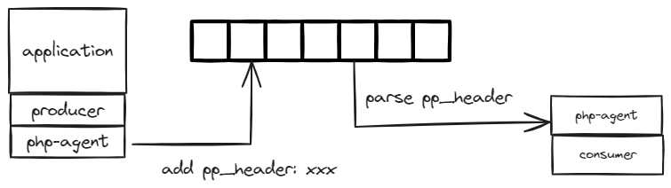
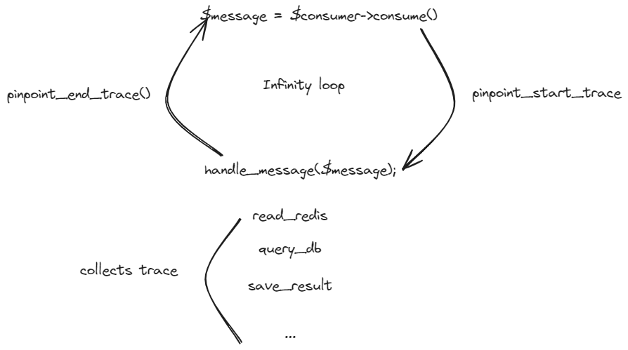
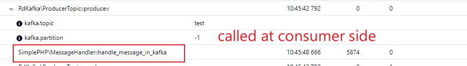

## Command 

```sh
$ docker compose up simple-php
```

## How to combine kafka producer and consumer together

> Background: some applications use message queue as worker/task dispatcher, but how to address the task dispatcher problems?

Use pinpoint-php agent asynchronous API, it adds some specially header(mask) into message and collects related function call. 



#### Define a full span into consumer side

> start: kafka message response \
> end:  start waiting a new message



#### Inside Code 

1. Producer side 

```php

// run.php 
$topic->producev(RD_KAFKA_PARTITION_UA, 0, "I'm Message $i", "key", $headers); // only support message with header(header annotation API)

// kafka interceptor
//  lib/Pinpoint/Plugins/SysV2/_rdKafka/rdKafka.php

$producev_on_before = function ($partition, $msgflags, $payload, $key = NULL, $headers = [], $timestamp_ms = NULL, $opaque = NULL) {
    pinpoint_start_trace();
    ...
}

pinpoint_join_cut(
    ["RdKafka\ProducerTopic", "producev"],
    $producev_on_before,
..
);

```

2. Consumer side

```PHP
// kafka_consumer.php
 $message = $consumer->consume(120 * 1000);
    switch ($message->err) {
        case RD_KAFKA_RESP_ERR_NO_ERROR:

            $handler = new SimplePHP\MessageHandler();
            $handler->handle_message_in_kafka($message);
            break;
            ...

// lib/Pinpoint/Plugins/SysV2/_rdKafka/rdKafka_consumer.php

$rdKafka_consumer_on_before = function ($timeout) use ($interceptor) {
    Logger::Inst()->debug("call rdKafka_consumer_on_before");
    $depth = pinpoint_get_trace_depth();
    switch ($depth) {
        case 0:
            pinpoint_end_trace();
            ...}
    };

pinpoint_join_cut(
    ["RdKafka\KafkaConsumer", "consume"],
    $rdKafka_consumer_on_before,
    ...
    }

```
#### Inside pinpoint

