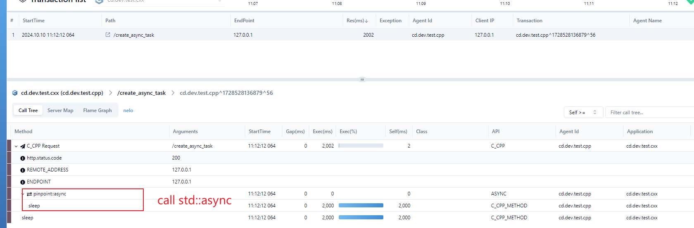

### Compile

```
$ mkdir build && cd build && cmake .. && make 
$ ./server
$ # client command
$ curl http://127.0.0.1:8080/create_async_task 
$ curl http://127.0.0.1:8080/hi 
```

### Needs help 

https://github.com/pinpoint-apm/pinpoint-c-agent/issues/new?assignees=&labels=&projects=&template=custom.md&title=[CXX] 

### Explanation

#### 1. How to trace async in cpp ?
  
Sleep was called in a background thread which can be find in async block like `⇆`. 



```cpp
  p_svr.Get("/create_async_task",
            [](const httplib::Request &, httplib::Response &res) {
              auto task = []() -> int {
                pinpoint::pin_func("sleep", sleep, 2);
                return 0;
              };
              auto async_res = pinpoint::async(task);
              pinpoint::pin_func("sleep", sleep, 2);
              pp_trace("async_task: %d", async_res.get());

              res.status = StatusCode::OK_200;
              res.set_content("sleep 5s!", "text/plain");
            });
```