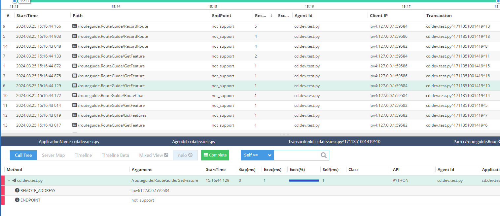

test grpc-python example copy from https://github.com/grpc/grpc/tree/master/examples/python/multiplex

> if you have any question, please create an issue with a `grpc-python` tag, thanks 🙏 


### Guide 

1. import `pinpointPy` into your project
2. active `PinpointServerInterceptor` on your `grpc.server`
```py
   server = grpc.server(futures.ThreadPoolExecutor(
        max_workers=10), interceptors=[PinpointServerInterceptor()])
    route_guide_pb2_grpc.add_RouteGuideServicer_to_server(
        RouteGuideServicer(), server
    )
```

>PS: run `python route_guide_client.py`

#### Grpc in pinpoint-py

> ❗ EndPoint does not support




