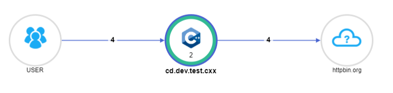
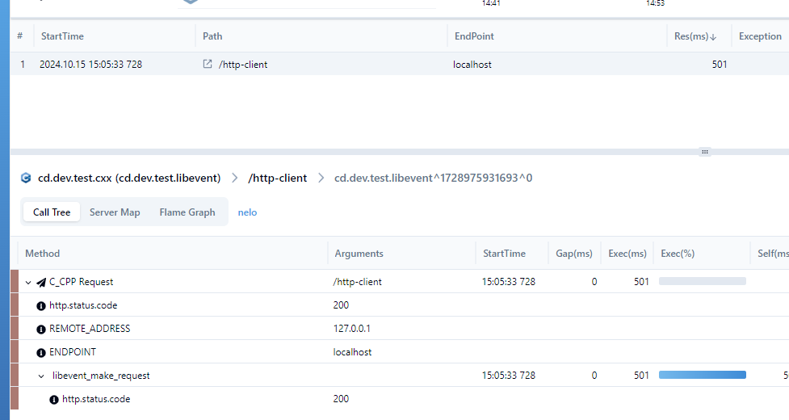
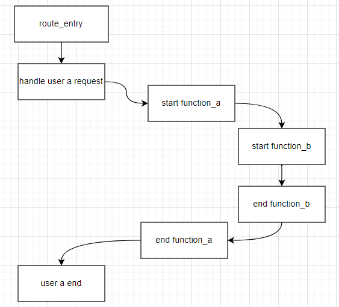
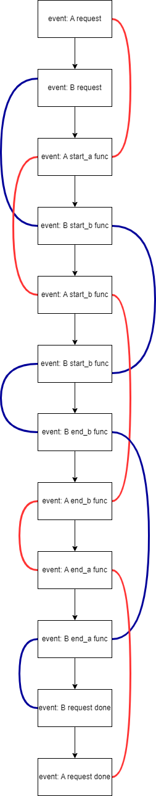

> PS: hopes help pinpoint on c in asynchronous context

## Command

```
$ mkdir build && cd build && cmake .. && make -j
$ # curl http://localhost:8080/http-client
```

### Thanks

- https://github.com/libevent/libevent
- https://github.com/libevent/libevent/blob/master/sample/http-server.c

### Chart

> server map



> call stack 



## Introduction for pinpoint on asynchronous framework

> what's problem in asynchronous framework (event driver)?

In synchronous, we gets trace by it's called order, that is the logical order when handling request, but in asynchronous framework, trace are driven by event, it's the event order. So, we must find a way to recover the logical order. 

### Synchronous call flow



### Asynchronous call flow

>  Red line: user A logical flow \
   Blue line: user B logical flow

  

Here is the question, how to separate A and B from mixed call chains ?
  
>Inspired by nginx

Pass `ctx` to everywhere 

```c
#define CTX_MATIC_NUM 0x1357325l
typedef struct {
  int magic_num_;
  NodeID current_id_;  // current trace ID
  void *ori_arg_;
  void (*on_complete_cb_origin_)(struct evhttp_request *, void *);
  void *on_complete_cb_arg_origin_;

  void (*http_client_request_cb_)(struct evhttp_request *, void *);
  void *http_client_request_done_cb_arg_;
  ...
} pp_request_context_t;
```

If you want to trace `foo` function,

1. add `ctx` into parameter list

|Old | Now|
|----|----|
|void foo(int a, ...)| void foo(void* ctx, int a,...)|

2. wrapper `foo` function

```c
void foo(void *ctx,int a, ...);

void pp_foo(void *ctx,int a, ...){
    ...
    NodeID trace_id = pinpoint_start_trace(ctx_.current_id_);
    foo(ctx,a);
    // end current trace and update current_id_
    ctx_.current_id_ = pinpoint_end_trace(trace_id);
}
...
call_pp_foo();
...
```

3. what if needs to register a callback function?

Before
``` 
// some like
async_http_request(.. request_done_call_cb,request_done_call_cb_arg...);

```
Now
```
cxt->origin_request_done_call_cb = request_done_call_cb;
ctx->origin_request_done_call_cb_arg = request_done_call_cb_arg
int pp_request_done_call_cb(arg){
    cxt->origin_request_done_call_cb(ctx->origin_request_done_call_cb_arg);
}; 

async_http_request(ctx,.. pp_request_done_call_cb,ctx,...);

```

While, there are many unknown cases in below list. If you have any question, [create an issue 🙋‍♂️ ](https://github.com/pinpoint-apm/pinpoint-c-agent/issues/new).


