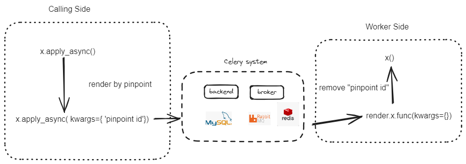
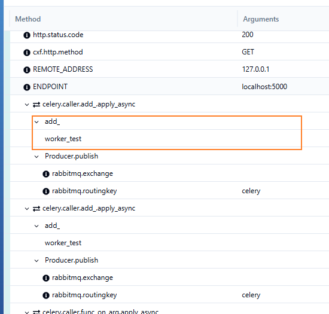

## How to use 

```
$ cd testapps && docker compose up py-celery --build
```

### Detail Into celery and pinpoint

>  2024-11-12

#### Trace Call-Chain in Celery

> How to pass `pinpoint id` to worker

Use parameters hidden policy to by-pass pinpoint id

```
def foo(**kwargs):
  a = kwargs['a']
  b = kwargs['b']
```
foo(a=1,b=2)
After add pinpoint, it renders calling side with foo(a=1,b=2, pinpoint_id ='xxx' ...), it's accepted in python, meanwhile, also fine in celery.



### Bind Caller Side and Worker Side together

> Use pinpoint



Caller

```py

@app.route('/test_apply_async', methods=['GET'])
def test_apply_async():
    task = add_.apply_async(args=[3, 4], kwargs={})

```

Worker 

```
@CeleryCallerPlugin()
@celery.task()
@CeleryWorkerPlugin()
@PinpointCommonPlugin()
def add_(a, b):
    worker_test()
    return a + b
```