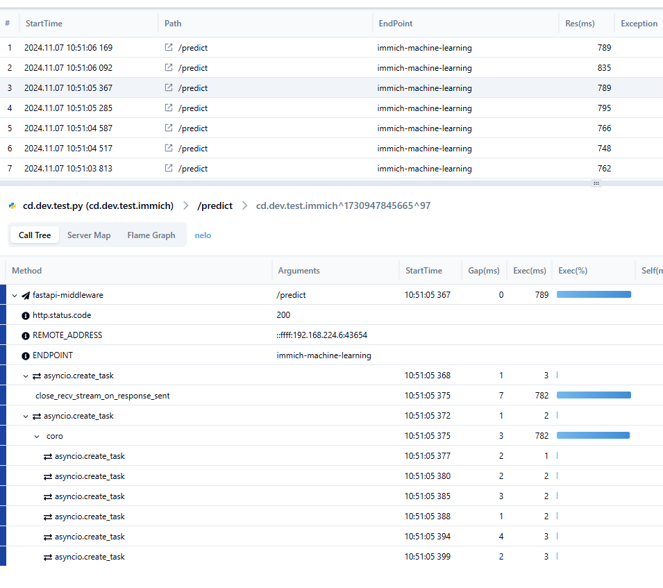

### How to use

> Where I get those file 
> https://immich.app/docs/install/docker-compose/

```
docker compose up
```

- [main.py](main.py) it's an example for how to add pinpointpy

#### In pinpoint-web

