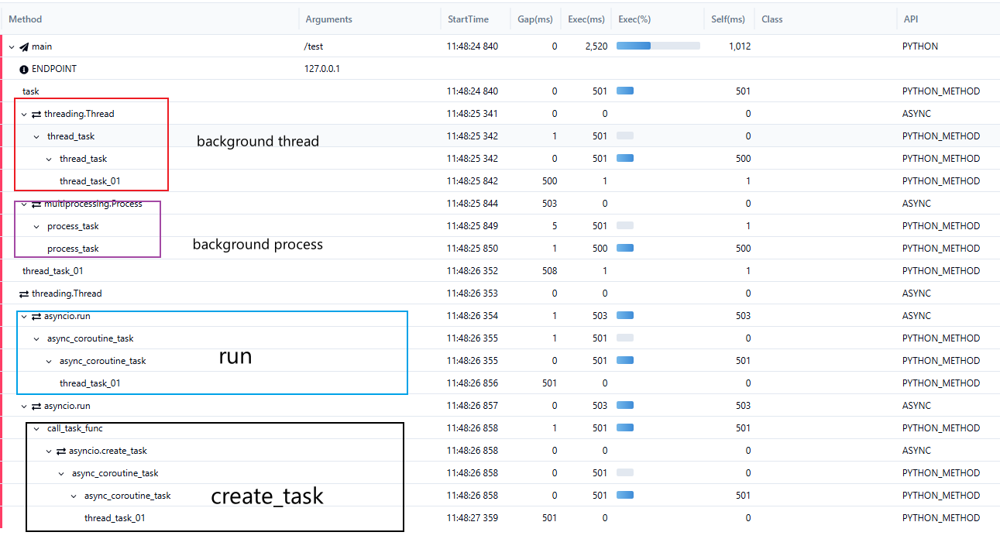

## Usage 

- How to use pinpointPy on standalone server/script ?
- What can get from pinpoint in asynchronous task: thread/process/asynio 

### Monitor thread/process/asyncio 

> please enable `enable_experiment_plugins()` ‼️ 



#### Detail 

> Hook the `Thread.__init__`, `Process.__init__` ... function, use decorator to wrap the origin function

```py
class HookTargetPlugins(PinTrace):
    def onBefore(self, parentId: int,  *args, **kwargs):

       .... 

        if 'target' in kwargs:
            origin_target = kwargs['target']

            def pp_new_entry_func(*args, **kwargs):
                # start trace
              
                if callable(origin_target):
                    # todo add
                    origin_target(*args, **kwargs) #<--- call the origin_target
...

        return traceId, args, kwargs
```
In sample code
``` py
        thread = threading.Thread(target=thread_task,) # thread_task -> origin_target
        thread.start()
        thread.join()
```

